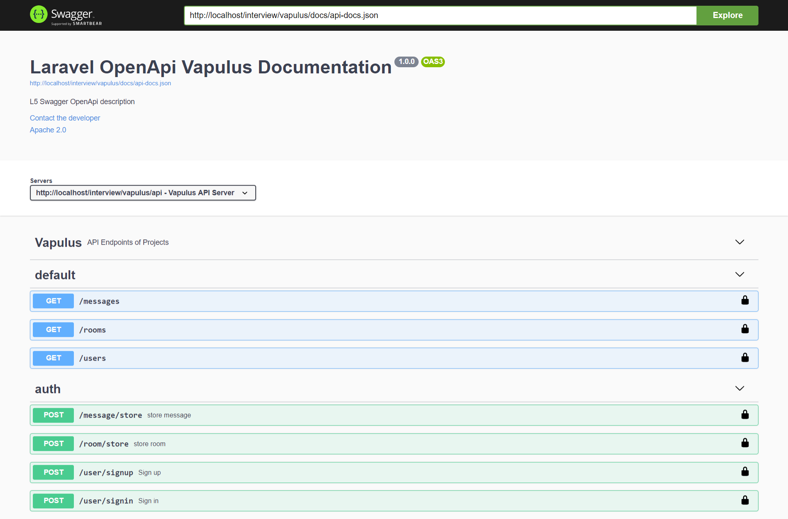
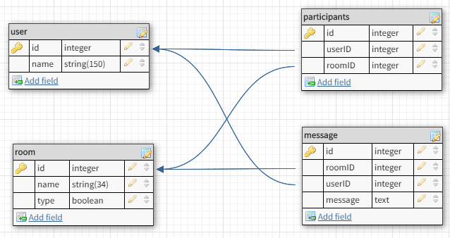

## Installation

- install composer of project: "composer install"
- install passport package for auth api: "composer install":
    "php artisan passport:install"
    "php artisan passport:client --personal" -> "vapulus"
- install migration of database project: "php artisan migrate"
- run faker to make fill data into database: "php artisan db:seed"

## Coding

- all business logic in "UserController.php", "RoomController.php", "MessageController.php" class.
- all api in "api.php" file.
- all models class in "User.php", "Room.php", "Message.php".

## API Document:

- Postman: https://documenter.getpostman.com/view/8316268/TW6uqpZw
- Swagger: http://localhost/interview/vapulus/api/documentation

## Swagger ScreenShot

## Database Schema

## Tools

- Programming Language: PHP 7.2
- Framework: Laravel 8.04
- Database: MySQL

## Packages

- Passport Package
- Swagger Package
